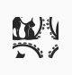

  
  
  
  
   
  
  
  
  
  

 

   

   <h1 align="center">podopieczni.pl</h1>

   

        
       The perfect data managment app and animal promotion platform.
        
        
       <a href="https://podopieczni-21142.vercel.app"><strong>Website »</strong></a>
        
        
       <a href="https://podopieczni-21142.vercel.app/demo">Demo</a>
       ·
       <a href="https://podopieczni-21142.vercel.app/shelter">For shelters</a>
       ·
       <a href="https://github.com/21142/podopieczni/issues">Issues</a>
    

  
Table of Contents

  <ol>
    <li>
      <a href="#about-the-project">About The Project</a>
      <ul>
        <li><a href="#built-with">Built With</a></li>
      </ul>
    </li>
    <li>
      <a href="#getting-started">Getting Started</a>
      <ul>
        <li><a href="#prerequisites">Prerequisites</a></li>
        <li><a href="#installation">Installation</a></li>
      </ul>
    </li>
    <li><a href="#usage">Usage</a></li>
    <li><a href="#license">License</a></li>
    <li><a href="#contact">Contact</a></li>
    <li><a href="#acknowledgments">Acknowledgments</a></li>
  </ol>

 

## About The Project

 

[![Podopieczni Screen Shot][product-screenshot]][product-url]

TODO: Add summary of the project

<a href="#readme-beginning">&#9650;</a>

### Built With

 

- [![Next][Next.js]][Next-url]
- [![React][React.js]][React-url]
- [![TypeScript][ts]][ts-url]
- [![tRPC][tRPC]][tRPC-url]
- [![Prisma][prisma]][prisma-url]
- [![Planetscale][planetscale]][planetscale-url]
- [![MySQL][mysql]][mysql-url]
- [![Vercel][vercel]][vercel-url]
- [![Github Actions][githubactions]][githubactions-url]
- [![React-Hook-Form][reacthookform]][reacthookform-url]
- [![TailwindCSS][tailwind]][tailwind-url]
- [![HeadlessUI][headlessui]][headlessui-url]

<a href="#readme-beginning">&#9650;</a>

## Getting Started

 

TODO: Add getting started guide

### Prerequisites

 

TODO: Add prerequisites

### Installation

 

TODO: Add installation guide

<a href="#readme-beginning">&#9650;</a>

## Usage

 

TODO: Add usage

<a href="#readme-beginning">&#9650;</a>

## License

 

Distributed under the MIT License. See `LICENSE` for more information.

<a href="#readme-beginning">&#9650;</a>

## Contact

 

Hi, I'm Maciej, a developer of podopieczni.

 

 
 

Above I've listed ways to contact me.

 

Link to my [github profile](https://github.com/21142)

 

<a href="#readme-beginning">&#9650;</a>

## Acknowledgments

 

TODO: Add acknowledgments

<a href="#readme-beginning">&#9650;</a>

[product-screenshot]: public/images/product-screenshot.png
[product-url]: https://podopieczni-21142.vercel.app
[Next.js]: https://img.shields.io/badge/next.js-000000?style=for-the-badge&logo=nextdotjs&logoColor=white
[Next-url]: https://nextjs.org/
[React.js]: https://img.shields.io/badge/React-20232A?style=for-the-badge&logo=react&logoColor=61DAFB
[React-url]: https://reactjs.org/
[ts]: https://img.shields.io/badge/typescript-20232A?style=for-the-badge&logo=typescript
[ts-url]: https://www.typescriptlang.org/
[tRPC]: https://img.shields.io/badge/tRPC-20232A?style=for-the-badge&logo=trpc
[tRPC-url]: https://trpc.io/
[prisma]: https://img.shields.io/badge/Prisma-20232A?style=for-the-badge&logo=prisma
[prisma-url]: https://www.prisma.io/
[tailwind]: https://img.shields.io/badge/tailwindCSS-20232A?style=for-the-badge&logo=tailwindcss
[tailwind-url]: https://tailwindcss.com/
[vercel]: https://img.shields.io/badge/vercel-20232A?style=for-the-badge&logo=vercel
[vercel-url]: https://vercel.com/
[planetscale]: https://img.shields.io/badge/planetscale-20232A?style=for-the-badge&logo=planetscale
[planetscale-url]: https://planetscale.com/
[githubactions]: https://img.shields.io/badge/githubactions-20232A?style=for-the-badge&logo=githubactions
[githubactions-url]: https://github.com/features/actions
[reacthookform]: https://img.shields.io/badge/reacthookform-20232A?style=for-the-badge&logo=reacthookform
[reacthookform-url]: https://react-hook-form.com/
[headlessui]: https://img.shields.io/badge/headlessui-20232A?style=for-the-badge&logo=headlessui
[headlessui-url]: https://headlessui.com/
[mysql]: https://img.shields.io/badge/mysql-20232A?style=for-the-badge&logo=mysql
[mysql-url]: https://www.mysql.com/
